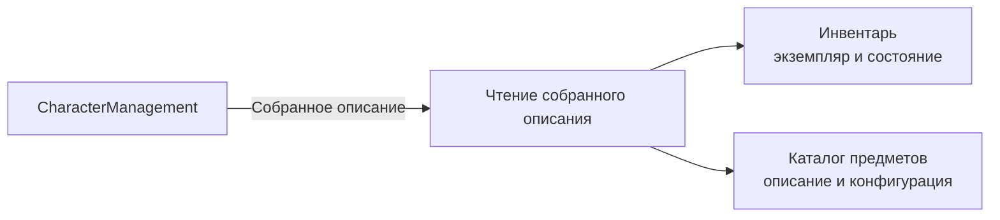
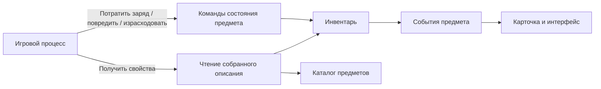
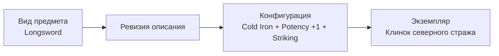

# Целевая архитектура кампаний, предметов, инвентаря и торговли

## Паспорт документа

| Поле | Значение |
|---|---|
| Формат | Облегчённое Architecture Definition Document по доменам TOGAF |
| Статус | Согласованное целевое архитектурное направление |
| Дата фиксации | 21 июля 2026 года |
| Область | Кампании и партии, каталог предметов, экземпляры, инвентарь, магазины, торговля и интеграция с персонажем |
| Исходная система правил | Pathfinder 2e Remaster |
| Текущая реализация `Store.*` | Может использоваться как источник контекста, но не является целевой моделью |

Документ применяет практическую структуру TOGAF к одному набору связанных bounded contexts. Это не полный корпоративный пакет TOGAF и не план немедленной реализации. Его назначение — зафиксировать согласованное устройство будущей системы и границы ответственности до декомпозиции на задачи.

Терминология на русском языке ещё не нормализована. До создания отдельного глоссария в документе используются русские рабочие термины, а названия будущих программных контрактов приводятся на английском только там, где это помогает однозначно определить техническую границу.

---

## 1. Архитектурное видение

### 1.1. Проблема

Текущий `CharacterManagement` поддерживает только стартовый набор первого уровня. Он хранит стабильные идентификаторы предметов, количество и состояние экипировки, а минимальный каталог содержит характеристики, необходимые для создания персонажа. Этого недостаточно для будущих сценариев:

- конкретные физические экземпляры с уникальным именем и историей;
- руны, материалы и другие постоянные изменения;
- заряды, расходование, повреждение, поломка и ремонт;
- скрытые свойства, проклятия и разный уровень знания наблюдателей;
- магазины в разных поселениях с собственным ассортиментом;
- пополнение ассортимента по правилам;
- покупка, продажа и передача предметов;
- ручное создание уникальных предметов администратором;
- объединение игроков и их персонажей в партии под руководством ведущего игры;
- свободная передача и обмен предметами между участниками одной партии;
- будущие добыча, ремесло и регулируемый обмен между партиями или кампаниями.

Legacy-модель `Store.*` проектировалась под старые правила, смешивает товар, игровое описание и торговое представление и не считается основой целевой архитектуры.

### 1.2. Цель

Создать модульную модель, в которой:

1. нормативное описание вида предмета отделено от физического экземпляра;
2. один предмет может сочетать оружие, защиту, расходование, заряды, прочность и другие возможности;
3. инвентарь является владельцем экземпляров, их расположения и изменяемого состояния;
4. торговля владеет магазинами, предложениями, ценами и сделками, но не боевыми формулами;
5. `CharacterManagement` получает собранное описание конкретного предмета через собственный прикладной контракт;
6. скрытые свойства участвуют в правилах, даже если не раскрыты игроку;
7. переход от текущего стартового снаряжения выполняется поэтапно без зависимости создания персонажа от незавершённого магазина.
8. полномочия ведущего и игрока задаются внутри конкретной кампании, а не глобальной ролью учётной записи;
9. игровые предметы, магазины и партии изолированы границами кампании;
10. участники одной партии могут передавать предметы напрямую, без магазина и торговой комиссии.

### 1.3. Ожидаемая ценность

- персонаж может владеть, экипировать, использовать, повреждать и продавать конкретные предметы;
- стандартные и уникальные предметы используют одну расширяемую модель;
- добавление нового сочетания возможностей не требует разрастания дерева наследования;
- магазин может иметь конечный и воспроизводимо сгенерированный ассортимент;
- административные изменения контролируются версиями, проверками и журналом операций;
- боевая карточка и будущий игровой процесс получают единый, объяснимый состав характеристик предмета.
- ведущий управляет игровым миром и скрытой информацией, не получая неаудируемого доступа к данным других кампаний;
- игроки могут безопасно дарить, обменивать и складывать предметы в общее хранилище партии.

### 1.4. Вне текущего решения

- окончательный русскоязычный глоссарий;
- полный каталог предметов Pathfinder 2e;
- детальные правила ремесла, добычи и торговли между игроками;
- конкретный интерфейс административной панели;
- окончательное решение о выделении микросервисов;
- немедленная замена текущего стартового снаряжения;
- исполнение всех текстовых эффектов предметов.

---

## 2. Заинтересованные стороны и их интересы

| Сторона | Основной интерес |
|---|---|
| Игрок | Понимать, чем он владеет, что экипировано, сколько осталось зарядов и почему изменились показатели |
| Ведущий игры | Управлять своей кампанией, партиями, магазинами, добычей, уникальными предметами и скрытой информацией |
| Системный администратор | Управлять общим каталогом и исправлять данные системы с отдельным аудитом |
| Разработчик правил | Добавлять новые виды предметов и сочетания возможностей без дублирования формул |
| Разработчик торговли | Управлять ассортиментом, ценами и сделками без владения боевыми правилами |
| Разработчик персонажа | Получать достоверные характеристики экипированных экземпляров через устойчивый контракт |
| Сопровождение | Воспроизводить генерацию, находить потерянные или дублированные предметы и безопасно обновлять каталог |

---

## 3. Архитектурные принципы

### 3.1. Состав вместо жёсткого наследования

Предмет не обязан принадлежать ровно одному поведенческому типу. Основная категория используется для навигации и поиска, а правила определяются набором типизированных компонентов.

Щит, например, может одновременно предоставлять:

- защиту щитом;
- способ атаки ударом щита;
- собственную прочность;
- возможность экипировки;
- места для прикрепляемых улучшений.

### 3.2. Категория не определяет поведение

Категории `Оружие`, `Броня`, `Щиты`, `Расходуемые предметы`, `Боеприпасы`, `Руны`, `Инструменты`, `Контейнеры` и `Прочее снаряжение` предназначены для каталога и интерфейса. Боевая и хозяйственная логика не должна ветвиться только по категории.

### 3.3. Опубликованное описание неизменно

Исправление опубликованного вида предмета создаёт новую ревизию. Старые экземпляры продолжают ссылаться на прежнюю ревизию, пока не выполнена явная миграция.

### 3.4. Экземпляр хранит только собственное изменяемое состояние

Экземпляр не копирует полное описание предмета. Он хранит ссылку на неизменяемую конфигурацию, текущее расположение, количество и только те состояния, которые меняются у конкретного предмета.

### 3.5. Источники хранятся, итоги вычисляются

В экземпляре не хранится готовая строка урона вроде `2d8+4`. Хранятся базовое оружие, руны, материал, состояние и другие источники. Итоговый бросок вычисляется из них и состояния персонажа.

### 3.6. Полное и видимое описание разделены

Серверные правила получают все свойства предмета, включая скрытые. Игрок получает только свойства, доступные конкретному наблюдателю.

### 3.7. Изменения выполняются командами владельца состояния

Заряды, прочность, количество, расположение и жизненный цикл нельзя переписывать из `CharacterManagement` или клиента. Они изменяются командами модуля инвентаря с проверкой версии и идентификатором операции.

### 3.8. Модульная монолитная архитектура является исходным выбором

Модули имеют отдельные модели, прикладные контракты и схемы данных, но развёртываются единым приложением, пока масштаб и эксплуатационные требования не обоснуют физическое разделение.

### 3.9. Роль задаётся в области кампании

`Secure` подтверждает личность пользователя и глобальные системные полномочия. Роли ведущего и игрока принадлежат членству в конкретной кампании. Один пользователь может быть ведущим в одной кампании и игроком в другой.

### 3.10. Кампания является границей игрового мира

Партии, персонажи-участники, магазины, мировые контейнеры, уникальные предметы и знания о скрытых свойствах принадлежат кампании. Обычная игровая операция не переносит предмет между кампаниями.

### 3.11. Обмен внутри партии не является торговлей

Дарение, взаимный обмен и работа с общим хранилищем партии не требуют магазина, расчёта цены или торговой комиссии. Они остаются операциями передачи владения и обязаны проверять согласие, права, ограничения предмета и конкурентные изменения.

---

## 4. Исходная архитектура

### 4.1. Действующее состояние

- `CharacterManagement` владеет starting-equipment rules, классовыми наборами и состоянием экипировки черновика; завершённый персонаж после миграции сохраняет совместимое starting state и runtime references;
- `Inventory` владеет campaign-scoped физическими экземплярами, количеством, текущим контейнером, версией и журналами операций и перемещений;
- стоимость, применимое владение, общая Масса и нагрузка вычисляются сервером;
- `CampaignManagement` реализует кампании, приглашения, предметные роли, одну активную партию, назначение персонажей и campaign-scoped доступ к карточке;
- личные, партийные, магазинные и мировые корневые контейнеры представлены `InventoryContainer`; общее хранилище связано с пользовательскими командами и настраиваемой политикой партии;
- текущий `Store` отключён в web composition root;
- legacy `TeamsController` не задаёт целевую модель; действующая модель находится в `CampaignManagement`;
- `Secure` содержит глобальные роли и permissions, а роли ведущего и игрока в области отдельной кампании разрешает `CampaignManagement`;
- gift, exchange, party storage и forced GM move опубликованы как runtime-команды; магазины, торговые сделки, заряды, расходование, руны и повреждение предметов отсутствуют;
- текущая граница описана в [../character_creation/equipment_inventory_boundary.md](../character_creation/equipment_inventory_boundary.md).

### 4.2. Ограничения исходного состояния

- command API передачи между участниками одной партии и общим хранилищем реализован; read projections и UI ещё отсутствуют;
- вложенные контейнеры относятся к следующим этапам;
- отсутствует модель знаний о скрытых свойствах;
- пока поддерживается только одна активная партия на кампанию;
- магазин нельзя подключить без смешения старой и новой ответственности.

---

## 5. Целевая бизнес-архитектура

### 5.1. Основные возможности

| Возможность | Владелец |
|---|---|
| Создать и опубликовать описание вида предмета | Каталог предметов |
| Создать кампанию и назначить ведущего | Управление кампаниями |
| Пригласить игрока и включить его персонажа в партию | Управление кампаниями |
| Управлять общим хранилищем и правилами обмена партии | Управление кампаниями совместно с инвентарём |
| Создать неизменяемую конфигурацию из основы, материала и улучшений | Каталог предметов |
| Породить физический экземпляр | Инвентарь через фабрику предметов |
| Хранить владельца, расположение, количество и состояние | Инвентарь |
| Экипировать предмет и вычислить показатели персонажа | `CharacterManagement` |
| Применить предмет в игровом действии | Будущий игровой процесс / столкновения |
| Потратить заряд, повредить или уничтожить экземпляр | Инвентарь |
| Определить ассортимент и цену магазина | Торговля |
| Купить или продать предмет | Торговля с передачей экземпляра через инвентарь |
| Подарить предмет участнику партии | Инвентарь после авторизации членства и владения |
| Обменять набор предметов между двумя участниками | Координатор обмена и инвентарь |
| Определить, что известно наблюдателю | Знание о предметах |
| Создать уникальный предмет вручную | Административный интерфейс над каталогом и инвентарём |

### 5.2. Ключевые процессы

#### Создание кампании и партии

1. Пользователь создаёт кампанию и получает в ней роль ведущего.
2. Ведущий создаёт первую партию кампании.
3. Ведущий приглашает игроков или подтверждает их заявки.
4. Игрок добавляет в партию персонажа, которым он имеет право управлять.
5. Управление кампаниями фиксирует членство, роль, контролируемого персонажа и состояние участия.
6. Для партии создаётся корневое общее хранилище; выбор политики доступа и наполнение принадлежат следующим этапам.

#### Прямое дарение внутри партии

1. Игрок выбирает собственный предмет или часть стопки и получателя из той же партии.
2. Проверяются активное членство, управление исходным персонажем, владение предметом и ограничения передачи.
3. Получатель подтверждает принятие, чтобы ему нельзя было навязать предмет, в том числе потенциально опасный или обременяющий.
4. Инвентарь атомарно разделяет стопку при необходимости и перемещает предмет получателю.
5. Операция записывается в журнал; цена и магазин не участвуют.

#### Взаимный обмен внутри партии

1. Один игрок создаёт предложение с набором отдаваемых и запрашиваемых предметов.
2. Все предметы предложения временно резервируются.
3. Второй игрок принимает неизменившееся предложение.
4. Повторно проверяются владение, версии и ограничения всех предметов.
5. Обе стороны обмена выполняются атомарно; при любой ошибке не передаётся ничего.
6. Резервы снимаются, операция записывается в журнал.

#### Общее хранилище партии

1. Участник помещает допустимый предмет в контейнер партии.
2. Предмет становится собственностью партии, а не конкретного персонажа.
3. Получение предмета из хранилища проверяется политикой партии: свободный доступ, подтверждение ведущего или отдельное разрешение участника.
4. Все поступления и изъятия сохраняют автора, причину и идентификатор операции.

#### Публикация вида предмета

1. Администратор создаёт черновик.
2. Добавляет основные поля и компоненты правил.
3. Валидатор проверяет обязательные поля и допустимость сочетаний.
4. Выполняется предварительный расчёт разрешённых характеристик.
5. Черновик публикуется как неизменяемая ревизия.
6. Предыдущая ревизия остаётся доступной для существующих экземпляров.

#### Создание уникального предмета

1. Выбирается базовая ревизия вида предмета.
2. Добавляются материал, руны, постоянные изменения и скрытые эффекты.
3. Создаётся неизменяемая конфигурация.
4. На её основе создаётся физический экземпляр.
5. Экземпляру назначаются имя, начальное состояние и местоположение.
6. Операция записывается в административный журнал.

#### Покупка

1. Торговля получает актуальное предложение.
2. Остаток и цена резервируются.
3. Проверяются доступ покупателя и денежные средства.
4. Для каталожного предложения создаётся экземпляр; для складского предложения используется существующий экземпляр.
5. Предмет или часть стопки перемещается в инвентарь персонажа.
6. Денежная операция фиксируется в учёте.
7. Резерв подтверждается, публикуется событие покупки.

#### Продажа

1. Проверяются владение, состояние, ограничения и отсутствие экипировки или другого резерва.
2. Магазин проверяет свою политику приёма.
3. Рассчитывается цена выкупа.
4. Предмет или часть стопки перемещается на склад магазина.
5. Деньги переводятся продавцу.
6. Публикуется событие продажи.

#### Использование заряда или повреждение

1. Игровой процесс получает полное собранное описание экземпляра.
2. Проверяет возможность действия.
3. Отправляет в инвентарь команду с ожидаемой версией экземпляра и идентификатором операции.
4. Инвентарь проверяет инварианты и изменяет состояние.
5. Событие обновляет проекции карточки и интерфейса.

---

## 6. Целевая прикладная архитектура

### 6.1. Модули

| Модуль | Ответственность |
|---|---|
| `CampaignManagement` | Кампании, членство, роли ведущего и игрока, партии, участие персонажей и политики общего хранилища |
| `ItemCatalog` | Виды предметов, ревизии, конфигурации, компоненты правил и описания эффектов |
| `Inventory` | Экземпляры, стопки, контейнеры, расположение, владение, изменяемое состояние и журнал перемещений |
| `Commerce` | Поселения, магазины, предложения, склад, цены, пополнение, кошельки и сделки |
| `CharacterManagement` | Экипировка персонажа, владение оружием и бронёй, производные показатели и боевая карточка |
| Будущий `Gameplay` / `Encounter` | Применение действий, атак, активаций и временных эффектов |
| `Administration` | Интерфейс и сценарии управления, но не отдельный владелец предметных данных |

`ItemGeneration`, ремесло и добыча сначала могут быть подсистемами соответствующих модулей. Они выделяются в отдельные bounded contexts только после появления самостоятельных правил и жизненного цикла.

### 6.2. Чтение собранного описания предмета

`CharacterManagement` не должен напрямую знать хранилище каталога или самостоятельно объединять основу, руны и состояние экземпляра. Он объявляет собственный прикладной порт чтения собранного описания предмета.



Домен `CharacterManagement` не получает ссылок на проекты `Inventory` или `ItemCatalog`. Его прикладной слой объявляет контракт и собственные типы результата; интеграционный адаптер собирает данные из модулей предметов.

### 6.3. Изменение состояния

Порт чтения не используется для записи. Изменения проходят через отдельные команды владельца состояния.



Минимальный набор прикладных портов:

- `IResolvedItemReader` — полное собранное описание для доверенных серверных правил;
- `IVisibleItemReader` — отфильтрованное описание для конкретного наблюдателя;
- `IItemStateCommands` — расходование, повреждение, ремонт, уничтожение, разделение стопки и перемещение;
- `IInventoryOwnershipReader` — проверка владения и доступности экземпляра;
- `IItemRestrictionPolicy` — запреты на снятие, передачу, продажу и иные операции.

### 6.4. Граница боевых расчётов

Разрешение предмета вычисляет:

- базовые характеристики оружия, брони и щита;
- материал;
- постоянные улучшения и руны;
- число базовых кубиков от striking rune;
- постоянный предметный бонус;
- доступные активации;
- текущее состояние зарядов, очков прочности и поломки;
- полный перечень явных и скрытых эффектов для доверенного правила.

`CharacterManagement` или будущий игровой процесс добавляет:

- характеристику персонажа;
- уровень и степень владения;
- классовые и feat-эффекты;
- временные бонусы и штрафы;
- выбранный способ хвата и тип урона;
- состояние столкновения.

Торговля не рассчитывает боевые значения.

### 6.5. Роли и полномочия в кампании

Роли `GM` и `Player` не добавляются в глобальные `Secure.Role`. `Secure` предоставляет идентификатор аутентифицированного пользователя и системные права администратора. `CampaignManagement` разрешает действия по членству пользователя в конкретной кампании.

Минимальные роли членства:

- ведущий игры (`GameMaster`) — управляет кампанией и её игровым миром;
- игрок (`Player`) — управляет назначенными ему персонажами и доступными ресурсами партии.

В будущем может быть добавлен помощник ведущего с ограниченным набором полномочий. Один пользователь может иметь несколько ролей в одной кампании, если ведущий одновременно управляет собственным персонажем.

#### Полномочия ведущего

Ведущий в пределах своей кампании может:

- приглашать и исключать участников;
- создавать партии и назначать в них персонажей;
- управлять поселениями, магазинами, добычей и мировыми контейнерами;
- создавать кампанийные описания, конфигурации и экземпляры уникальных предметов из разрешённых типизированных компонентов;
- выдавать, изымать, перемещать, повреждать и восстанавливать предметы административными командами;
- видеть все скрытые свойства и управлять их раскрытием;
- задавать политику общего хранилища партии;
- разрешать исключительные переносы, которые запрещены обычному игроку.

Принудительная операция ведущего всегда требует причины и отдельной записи аудита. Она не должна выглядеть как обычное действие игрока.

#### Полномочия игрока

Игрок в пределах кампании может:

- видеть открытые сведения кампании и партии;
- управлять только назначенными ему персонажами;
- видеть полный инвентарь своих персонажей и разрешённую информацию о чужих предметах;
- экипировать, использовать, разделять и перемещать принадлежащие его персонажу предметы;
- покупать и продавать от имени контролируемого персонажа;
- дарить и обменивать предметы с участниками той же партии;
- пользоваться общим хранилищем в соответствии с политикой партии;
- идентифицировать предметы и получать раскрытые ему свойства.

Игрок не может видеть скрытые свойства, изменять чужой личный инвентарь, создавать экземпляры административной командой или переносить предметы между кампаниями.

### 6.6. Авторизация предметных операций

Каждая команда с предметом получает действующего пользователя и предметный субъект операции:

```text
ItemOperationContext
  ActingUserId
  CampaignId
  PartyId?
  ActingCharacterId?
  OperationKind
```

Проверка проходит последовательно:

1. `Secure` подтверждает личность и глобальные системные права.
2. `CampaignManagement` подтверждает членство и роль в кампании.
3. Проверяется право управлять указанным персонажем.
4. Инвентарь проверяет владельца, расположение и состояние предмета.
5. Политика ограничений проверяет экипировку, проклятия, резервы и иные запреты.
6. Команда изменяет состояние и создаёт аудит.

Ни роль ведущего, ни участие в партии не передаются доверенным флагом с клиента; они разрешаются сервером по идентификатору пользователя и кампании.

---

## 7. Целевая информационная архитектура

### 7.1. Кампания, членство и партия

```text
Campaign
  Id
  Name
  Status
  CreatedByUserId

CampaignMembership
  CampaignId
  UserId
  Roles
  Status

Party
  Id
  CampaignId
  Name
  SharedInventoryPolicy

PartyCharacter
  PartyId
  CharacterId
  ControlledByUserId
  Status
```

На первом этапе кампания может содержать одну активную партию. Модель сохраняет отдельную сущность партии, чтобы позднее поддержать разделение группы, несколько отрядов в одном мире или временные подгруппы без переноса магазинов и предметов в другую кампанию.

Роль хранится в `CampaignMembership`, а не в глобальном пользователе. `PartyCharacter` связывает персонажа с партией и пользователем, который имеет право принимать обычные игровые решения от имени этого персонажа.

### 7.2. Три уровня предмета



#### Вид и ревизия

Вид задаёт устойчивую логическую личность, например `equipment.longsword`. Ревизия содержит неизменяемое нормативное описание на конкретный момент.

Описание имеет область действия:

- глобальное — доступно всем кампаниям и публикуется системным администратором;
- кампанийное — доступно только одной кампании и публикуется её ведущим в пределах разрешённых типизированных компонентов.

Кампанийное описание позволяет ведущему создать полностью авторский уникальный предмет, не загрязняя общий каталог и не раскрывая его другим кампаниям. Оно не может ссылаться на персонажей, магазины или экземпляры другой кампании.

#### Конфигурация

Конфигурация объединяет:

- базовую ревизию;
- размер изготовления;
- материал;
- руны и другие постоянные улучшения;
- постоянные открытые и скрытые эффекты;
- вычисленные уровень, цену и Массу, если они зависят от состава.

Одинаковая конфигурация может использоваться несколькими экземплярами. Уникальная конфигурация может породить ровно один экземпляр по административной политике.

#### Экземпляр

Экземпляр содержит:

- глобальный идентификатор;
- ссылку на конфигурацию;
- пользовательское имя и допустимые индивидуальные сведения;
- количество для объединяемых предметов;
- текущее расположение;
- состояние жизненного цикла;
- версию для защиты от конкурентных изменений.

### 7.3. Категории и компоненты правил

Основная категория отвечает на вопрос «где показывать предмет». Компоненты отвечают на вопрос «что предмет умеет».

Планируемые компоненты:

| Компонент | Назначение |
|---|---|
| Атака | Один или несколько способов атаки, кубик, тип урона, руки, дистанция и признаки |
| Броня | Категория брони, бонус защиты, предел Ловкости и штрафы |
| Щит | Бонус поднятого щита, твёрдость, максимальные очки прочности и порог поломки |
| Экипировка | Места и условия ношения, удержания или вложения |
| Расходование | Когда и в каком количестве предмет исчезает или уменьшается стопка |
| Заряды | Максимум, стоимость активации и правило восстановления |
| Активация | Действие, требования, частота и типизированный эффект |
| Прочность | Твёрдость, максимальные очки прочности, поломка, уничтожение и ремонт |
| Контейнер | Вместимость и правила вложенного хранения |
| Боеприпас | Совместимые группы оружия и правило расходования |
| Прикрепление | Допустимые основы и место установки |
| Основа для улучшений | Допустимые руны, материал и количество мест |
| Хранение в стопке | Правила объединения и разделения одинаковых единиц |
| Магический эффект | Типизированные постоянные или активируемые эффекты |

Один предмет может иметь любое валидное сочетание. Примеры:

| Предмет | Состав |
|---|---|
| Меч | Атака, экипировка, прочность, основа для улучшений |
| Кожаная броня | Броня, экипировка, прочность, основа для улучшений |
| Стальной щит | Щит, атака, экипировка, прочность, основа для улучшений |
| Лечебное зелье | Расходование, активация, магический эффект, хранение в стопке |
| Алхимическая бомба | Атака, расходование, алхимический эффект, хранение в стопке |
| Магический посох | Атака, заряды, активации заклинаний, экипировка, прочность |
| Магический боеприпас | Боеприпас, расходование, магический эффект |
| Проклятый меч | Атака, экипировка, прочность, скрытый эффект |

Щит не моделируется как наследник брони. Защита бронёй и защита щитом имеют разные правила. Возможность атаковать щитом выражается отдельным компонентом атаки. Шипы или навершие щита могут быть отдельным экземпляром, прикреплённым к щиту и добавляющим альтернативный способ атаки.

### 7.4. Распределение характеристик

| Характеристика | Владелец |
|---|---|
| Базовый кубик и тип урона | Ревизия вида предмета |
| Признаки оружия и способы атаки | Ревизия вида предмета |
| Размер изготовления | Конфигурация |
| Материал | Конфигурация |
| Руны и постоянные улучшения | Конфигурация и связи прикрепления |
| Пользовательское имя | Экземпляр |
| Текущие заряды | Состояние экземпляра |
| Текущие очки прочности и поломка | Состояние экземпляра |
| Количество в стопке | Экземпляр |
| Владение и расположение | Инвентарь |
| Итоговый бросок атаки и урона | Вычисление игрового процесса |

В Pathfinder 2e размер изготовленного оружия не масштабирует базовый кубик урона по старой таблице Pathfinder 1e. Он влияет на совместимость, цену и Массу по действующим правилам. Если проект когда-либо поддержит другой набор правил, масштабирование оформляется отдельной политикой набора правил, а не встраивается в общий экземпляр.

### 7.5. Изменяемое состояние экземпляра

Состояние создаётся только для присутствующих компонентов:

- `ItemDurabilityState` — текущие очки прочности, поломка и уничтожение;
- `ItemChargeState` — текущие заряды и сведения восстановления;
- `ItemQuantityState` — количество объединяемых единиц;
- `ItemAttachment` — основной и прикреплённый экземпляры, место установки;
- `ItemLocation` — текущий контейнер;
- `ItemLifecycleState` — доступен, зарезервирован, израсходован, уничтожен, утрачен;
- `ItemKnowledge` — раскрытые конкретному наблюдателю свойства.

Предмет без зарядов не получает пустое состояние зарядов. Уникальный предмет с собственной прочностью не объединяется в стопку.

### 7.6. Контейнеры, владение и расположение

Каждый игровой экземпляр получает неизменяемый `CampaignId`. Он не может оказаться в контейнере другой кампании обычной игровой командой.

Предмет находится ровно в одном месте:

- инвентарь персонажа;
- общее хранилище партии;
- вложенный контейнер;
- склад магазина;
- добыча в мире;
- прикрепление к другому предмету;
- резерв сделки;
- состояние уничтожения или расходования.

Владение выражается верхнеуровневым контейнером, а не произвольным полем на каждом вложенном предмете:

```text
InventoryContainer
  Id
  CampaignId
  OwnerKind: Character | Party | Shop | World
  OwnerId
  ParentContainerId?
```

Предмет в рюкзаке персонажа принадлежит персонажу через корневой контейнер, даже если вложен в несколько других контейнеров. Предмет в общем хранилище принадлежит партии. Предмет на складе магазина принадлежит магазину.

Текущее расположение хранится для быстрого чтения. Каждое перемещение дополнительно записывается в неизменяемый журнал:

```text
InventoryMovement
  ItemInstanceId
  FromContainerId
  ToContainerId
  Quantity
  Reason
  OperationId
  PerformedBy
  OccurredAt
```

### 7.7. Передача и обмен внутри партии

Прямой обмен не создаёт торговую цену и не проходит через магазин. Он использует отдельные сущности предложения и резерва:

```text
PartyExchange
  Id
  CampaignId
  PartyId
  InitiatorCharacterId
  CounterpartyCharacterId
  Status
  ExpiresAt
  Version

PartyExchangeLine
  ExchangeId
  FromCharacterId
  ItemInstanceId
  Quantity
  ExpectedItemVersion
```

Инварианты:

- оба персонажа состоят в одной активной партии;
- действующие пользователи управляют соответствующими персонажами;
- отдающая сторона владеет предметом;
- предмет не экипирован, не зарезервирован другой операцией и не запрещён к передаче;
- участник не может незаметно забрать предмет из личного инвентаря другого персонажа;
- обмен применяется целиком или не применяется вовсе;
- повторное подтверждение не выполняет перенос второй раз;
- изменение предмета после создания предложения делает старое предложение недействительным;
- ведущий может выполнить принудительный перенос только отдельной административной командой с причиной.

Для простого подарка используется тот же механизм с пустой встречной стороной. Политика обязательного подтверждения получателя может быть настроена позднее; исходный безопасный вариант требует подтверждения.

### 7.8. Скрытые свойства и знания

Авторитетное описание содержит все свойства. Представление игрока фильтруется по наблюдателю.

Поддерживаемые режимы видимости:

- видно сразу;
- видно после идентификации;
- скрыто до срабатывания;
- доступно только ведущему;
- временно отображается ошибочное описание.

`ItemKnowledge` хранится отдельно от экземпляра, поскольку разные персонажи могут знать о нём разное.

```text
ItemKnowledge
  ItemInstanceId
  ObserverCharacterId
  IdentificationLevel
  RevealedEffectIds
  LastExaminedAt
```

Наблюдателем может быть персонаж, партия или ведущий кампании. Ведущий получает полное авторитетное описание в пределах своей кампании. Знание игрока не выводится из роли пользователя вообще: оно относится к конкретному персонажу или явно разделено с партией.

Скрытый эффект участвует в серверной проверке даже до раскрытия. Например, проклятие может запретить снять или продать предмет. При выполнении условия раскрытия публикуется событие и обновляется знание наблюдателя.

### 7.9. Магазины и ассортимент

```text
Settlement
  Id
  Name
  Level
  Region
  Traits

Shop
  Id
  CampaignId
  SettlementId
  Name
  Specialization
  ShopLevel
  BuyPolicyId
  SellPolicyId
  RestockPolicyId
```

Предложение магазина бывает двух видов:

1. каталожное предложение стандартного товара с допустимым количеством;
2. предложение конкретного складского экземпляра, обязательное для уникального или индивидуально изменённого предмета.

```text
ShopOffer
  ShopId
  DefinitionRevisionId | VariantId | ItemInstanceId
  OfferKind
  AvailableQuantity
  UnitPriceCopper
  ValidUntil
  Status
```

Правило пополнения учитывает:

- уровень и особенности поселения;
- специализацию магазина;
- диапазон уровней предметов;
- редкость и доступ;
- бюджет и размер склада;
- разрешённые и запрещённые категории;
- веса категорий;
- долю расходуемых и постоянных предметов;
- период обновления;
- возможность появления уникальных конфигураций.

Поселение, магазин, склад и запуск пополнения принадлежат кампании. Это позволяет одному и тому же логическому городу иметь разное состояние в разных играх и не допускает покупки уникального экземпляра участником другой кампании.

Каждый запуск сохраняет версию правила и начальное значение генератора случайности, чтобы результат можно было воспроизвести.

### 7.10. Деньги и сделки

Денежные значения хранятся целым числом в минимальной единице, используемой проектом, а не `decimal`.

Текущее состояние кошелька дополняется журналом денежных операций. Покупка и продажа используют:

- резервирование остатка и товара;
- идентификатор операции для идемпотентности;
- проверку версии экземпляра;
- явное подтверждение или отмену;
- событие завершённой сделки.

Окончательный владелец кошелька — персонаж, учётная запись или отдельная экономическая сущность — остаётся открытым решением.

---

## 8. Технологическая архитектура

### 8.1. Стиль развёртывания

Исходная целевая форма — модульный монолит на существующем стеке .NET 8 и PostgreSQL:

- отдельный набор проектов или логических слоёв на bounded context;
- отдельная схема PostgreSQL на модуль;
- отсутствие прямых EF navigation properties между контекстами;
- прикладные порты для синхронных запросов;
- доменные и интеграционные события для обновления проекций;
- outbox для надёжной публикации событий после фиксации данных.

Переход к микросервисам не является целью сам по себе.

### 8.2. Хранение каталога

Рекомендуется гибридная реляционная модель:

- общие и часто фильтруемые поля ревизии хранятся в обычных колонках;
- область действия каталожной записи хранится явно как `Global` или `Campaign` с обязательным `CampaignId` для кампанийной записи;
- основные компоненты оружия, брони, щита, зарядов и расходования имеют типизированные таблицы или owned-модели;
- параметры редких типизированных эффектов могут храниться в версионированном `jsonb` с обязательным discriminator и schema version;
- произвольный исполняемый код и непроверяемые формулы из административной панели запрещены.

### 8.3. Хранение экземпляров

Идентичность, расположение, количество, жизненный цикл, версия, заряды и прочность хранятся в нормализованных таблицах. Изменяемые инварианты не должны зависеть от произвольного документа `jsonb`.

### 8.4. Согласованность и конкуренция

- команды изменения содержат `ExpectedVersion`;
- каждая пользовательская операция содержит `OperationId`;
- повтор команды с тем же `OperationId` возвращает прежний результат;
- одновременное расходование последнего заряда допускает только одного победителя;
- перенос между контейнерами и разделение стопки выполняются атомарно;
- многошаговая торговая операция использует единый координатор внутри монолита, а при будущем физическом разделении может быть заменена процессом с резервированием и компенсациями.

### 8.5. Проекции чтения

Для карточки, магазина и административного поиска допускаются отдельные проекции. Проекция содержит версию экземпляра и источников каталога. Она не становится владельцем инвариантов и может быть перестроена из нормативных данных и журналов.

### 8.6. Аутентификация и предметная авторизация

- `Secure` остаётся владельцем пользователя, входа и глобальных системных permissions;
- `CampaignManagement` хранит предметные роли ведущего и игрока;
- `CampaignId` используется как обязательная область авторизации и разделения игровых данных;
- прикладная команда не принимает решение о роли по клиентскому флагу или JWT claim длительного действия;
- полномочия перечитываются или проверяются через актуальную серверную проекцию членства;
- административное действие ведущего отличается по типу и журналу от обычного действия игрока;
- доступ к скрытым свойствам проверяется отдельно от доступа к самому экземпляру.

---

## 9. Разрыв между исходным и целевым состояниями

| Область | Сейчас | Цель |
|---|---|---|
| Каталог | Версионируемый `ItemCatalog`; legacy starting catalog остаётся переходным fallback | Версионируемый `ItemCatalog` — достигнуто для descriptions/configurations |
| Идентичность | Стабильный идентификатор вида | Ревизия → конфигурация → экземпляр |
| Поведение | Одна категория с nullable-деталями | Состав из типизированных компонентов |
| Состояние | Количество и экипированное количество | Заряды, прочность, жизненный цикл, прикрепления и расположение |
| Владение | Character-owned starting state | Отдельный инвентарь и журнал перемещений |
| Кампании и партии | Пустой `TeamsController` | Кампания, членство, роли, партии и участие персонажей |
| Авторизация ведущего и игрока | Только глобальные роли `Secure` | Предметная роль внутри конкретной кампании |
| Обмен игроков | Подарок, атомарный обмен и общее хранилище партии реализованы | Достигнуто для backend command boundary; остаются read projections и UI |
| Изоляция игрового мира | Отсутствует | `CampaignId` у runtime-экземпляров, магазинов и мировых контейнеров |
| Боевая интеграция | Application-owned порт с runtime Inventory adapter и starting fallback для ещё не мигрированных персонажей | Универсальный прикладной порт собранного описания экземпляра |
| Скрытые свойства | Отсутствуют | Авторитетное и видимое описание плюс знания наблюдателя |
| Магазины | Legacy-код, отключён | Поселения, магазины, предложения, склад и правила пополнения |
| Сделки | Отсутствуют | Резервы, денежный журнал, покупка и продажа |
| Администрирование | Backend draft/publish/retire API для descriptions; UI и instance tools отсутствуют | Черновики, публикация, создание экземпляров и аудит |

---

## 10. Возможности и решения по этапам

Детальная продуктовая последовательность зафиксирована в [Character Creation And Gameplay Roadmap](../../30_task_notes/character_creation_near_term_roadmap.md). Сначала выполняются глоссарий и Priority 8 с прикладной границей разрешённой экипировки; затем этапы настоящего документа переходят в следующие приоритеты:

| Архитектурный этап | Приоритет roadmap |
|---|---|
| Этап 0 | Ближайшая задача: глоссарий и детализация открытых решений |
| Этап 1 | Priority 9: кампании и партии — завершён 21 июля 2026 года |
| Этап 2 | Priority 10: версионируемый каталог предметов v2 — завершён 22 июля 2026 года |
| Этап 3 | Priority 11: экземпляры, инвентарь и миграция — завершён 22 июля 2026 года |
| Этап 4 | Priority 12: обмен партии — завершён 22 июля 2026 года |
| Этап 5 | Priority 13: магазины и ручная торговля |
| Этап 6 | Priority 14: инструменты ведущего; Priority 15: генерация ассортимента |
| Этап 7 | Priority 16: расширенный жизненный цикл предметов |

### Этап 0. Детализация архитектуры

- создать русскоязычный глоссарий;
- утвердить владельца кошелька;
- утвердить набор компонентов v1;
- определить контракты чтения и команд;
- определить схему идентификаторов и версий;
- утвердить жизненный цикл кампании, приглашения и удаления участника;
- утвердить политику принятия подарка и доступа к общему хранилищу;
- зафиксировать переход от текущего каталога отдельной ADR.

### Этап 1. Кампании и партии

**Статус:** завершён; итоговая проверка зафиксирована в [Priority 9 Final Cross-Review](../../30_task_notes/priority_9_final_review.md).

- кампания и предметное членство;
- роли ведущего и игрока;
- первая партия кампании;
- назначение персонажа игроку в партии;
- серверная авторизация по кампании;
- пустое общее хранилище партии.

### Этап 2. Каталог предметов

**Статус:** завершён; итоговая проверка зафиксирована в [Priority 10 Final Cross-Review](../../30_task_notes/priority_10_final_review.md).

- виды и неизменяемые ревизии;
- категории и типизированные компоненты;
- черновик, проверка, публикация и вывод из обращения;
- базовая конфигурация без сложной генерации;
- адаптер чтения для текущего `CharacterManagement`.

### Этап 3. Инвентарь

**Статус:** завершён; итоговая проверка зафиксирована в [Priority 11 Final Cross-Review](../../30_task_notes/priority_11_final_review.md).

- экземпляры и контейнеры;
- стопки и разделение;
- расположение и журнал перемещений;
- optimistic concurrency и идемпотентность;
- область кампании у экземпляров и контейнеров;
- личные и партийные корневые контейнеры;
- создать экземпляры для существующих character-owned references;
- сохранить текущую экипировку;
- переключить карточку на порт собранного описания предмета;
- оставить создание персонажа работоспособным при недоступности торгового модуля;
- после проверки заменить переходную ownership ADR.

### Этап 4. Обмен и общее хранилище партии

**Статус:** завершён; итоговая проверка зафиксирована в [Priority 12 Final Cross-Review](../../30_task_notes/priority_12_final_review.md).

- подарок с подтверждением получателя;
- резервирование обеих сторон и атомарное завершение или отмена обмена;
- общее party-owned хранилище с настраиваемой политикой доступа;
- централизованные ограничения передачи и optimistic version checks;
- различимый аудит действий игрока и принудительного перемещения ведущим.

### Этап 5. Ручной магазин и сделки

- поселения и магазины;
- ручной склад и предложения;
- кошельки и денежный журнал;
- покупка и продажа;
- запрет продажи экипированного, зарезервированного или ограниченного предмета.

### Этап 6. Административное управление и генерация

- создание уникальных конфигураций и экземпляров;
- скрытые эффекты и знания;
- правила пополнения;
- воспроизводимые запуски генерации;
- аудит административных действий;
- полномочия ведущего только в пределах собственной кампании.

### Этап 7. Расширенный жизненный цикл

- заряды и восстановление;
- расходование и боеприпасы;
- прочность, поломка, уничтожение и ремонт;
- руны и перенос улучшений;
- интеграция с игровыми действиями.

### Последующие этапы

- ремесло;
- добыча и награды;
- регулируемый обмен между партиями и кампаниями;
- вложение и идентификация;
- расширенное исполнение эффектов.

---

## 11. Риски и меры

| Риск | Последствие | Мера |
|---|---|---|
| Каталог и инвентарь дублируют характеристики | Два источника истины | Экземпляр ссылается на точную неизменяемую конфигурацию |
| `CharacterManagement` начинает знать внутренности каталога | Сильная связанность | Собственный прикладной порт и собственные типы собранного описания |
| Универсальный `jsonb` заменяет доменную модель | Непроверяемые инварианты | Типизированные компоненты и отдельные таблицы изменяемого состояния |
| Жёсткое наследование блокирует гибридные предметы | Специальные исключения для каждого предмета | Состав компонентов и валидатор сочетаний |
| Повтор запроса дублирует покупку или расход | Дюп предметов и денег | `OperationId`, резервы и журнал операций |
| Обновление шаблона меняет старые предметы | Непредсказуемые персонажи | Неизменяемые ревизии и явные миграции |
| Скрытое свойство утекает в клиент | Потеря игрового секрета | Раздельные полное и видимое представления |
| Проклятие обходится прямой продажей или снятием | Нарушение правил | Централизованная политика ограничений на команды |
| Роль ведущего сделана глобальной | Ведущий одной игры получает власть над другими играми | Хранить роль в членстве конкретной кампании |
| Предмет перемещается между кампаниями обычной командой | Нарушение экономики и утечка уникальных предметов | Неизменяемая область кампании и отдельная административная операция импорта |
| Игрок забирает предмет из чужого личного инвентаря | Кража без согласия владельца | Дарение владельцем, двустороннее подтверждение обмена и политика общего хранилища |
| Получателю навязывают проклятый или тяжёлый предмет | Нежелательное владение и обход игрового решения | Безопасный исходный вариант с подтверждением получателя |
| Ведущий меняет предмет как обычный игрок | Невозможно отличить сюжетное решение от ошибки или злоупотребления | Отдельные административные команды, причина и аудит |
| Скрытые свойства раскрываются всем членам партии автоматически | Потеря игрового секрета | Знание персонажа и партии хранить отдельно, раскрывать явной политикой |
| Ранняя реализация торговли задерживает боевую карточку | Потеря ближайшей продуктовой ценности | Проектировать сейчас, внедрять этапами независимо от Priority 8 |
| Legacy Store начинает ограничивать новую модель | Возврат старых правил | Рассматривать legacy только как миграционный источник, не как целевой контракт |

---

## 12. Зафиксированные решения

1. Целевая область разделяется на `CampaignManagement`, `ItemCatalog`, `Inventory` и `Commerce`; администрация является интерфейсом над ними.
2. `CharacterManagement` сохраняет ответственность за экипировку и character-specific расчёты, но не собирает предмет из хранилищ самостоятельно.
3. Предмет строится из основной категории и набора независимых типизированных компонентов.
4. Щит не является наследником брони; защита щитом и способ атаки представлены отдельными компонентами.
5. Используются три уровня: ревизия вида, неизменяемая конфигурация и физический экземпляр.
6. Базовый кубик урона принадлежит виду; размер, материал и постоянные улучшения — конфигурации; заряды и прочность — экземпляру.
7. Итоговые атака и урон вычисляются, а не сохраняются как готовые значения экземпляра.
8. Чтение собранного описания предмета и изменение его состояния разделены.
9. Полное серверное описание отделено от видимого конкретному наблюдателю.
10. Опубликованные ревизии и конфигурации не изменяются на месте.
11. Модульный монолит является исходной технологической формой.
12. Стартовое снаряжение остаётся состоянием черновика; completed-character loadout мигрирует в Inventory после однозначного назначения кампании.
13. Кампания является границей игрового мира для партий, runtime-предметов, магазинов, добычи и скрытых знаний.
14. Ведущий и игрок являются ролями членства в кампании, а не глобальными ролями пользователя.
15. Один пользователь может быть ведущим в одной кампании и игроком в другой.
16. На первом этапе кампания содержит одну активную партию, но модель допускает несколько партий в будущем.
17. Игровой персонаж участвует в партии через явное назначение управляющего игрока.
18. Прямой обмен внутри партии не использует магазин, цену или комиссию.
19. Обычный игрок может передавать только предметы контролируемого персонажа или доступные ему предметы общего хранилища.
20. Взаимный обмен резервирует обе стороны и выполняется атомарно после подтверждения.
21. Общее хранилище принадлежит партии и использует настраиваемую политику доступа.
22. Ведущий видит полное описание предметов своей кампании; игрок получает представление согласно знаниям персонажа или партии.
23. Принудительные операции ведущего являются отдельными командами с обязательной причиной и аудитом.
24. Общие описания предметов публикует системный администратор; ведущий может создавать отдельные описания только в области своей кампании.
25. Priority 8–12 завершены; торговля и расширенный жизненный цикл следуют по Priority 13–16.
26. `Bulk` предмета называется Массой, сумма переносимых значений — общей Массой, воздействие на персонажа — нагрузкой, а превышение порога — перегрузкой.

---

## 13. Открытые решения

1. Владелец денег: персонаж, учётная запись или отдельная экономическая сущность.
2. Формат типизированных activation/effect components сверх реализованных attack, armor, shield, equipment, consumption, charge и durability.
3. Правила совместимости размера, материала и постоянных улучшений с конкретными revisions/configurations.
4. Нужны ли мета-предметы на уровне учётной записи; обычные игровые экземпляры остаются внутри кампании.
5. Модель длительных резервов и компенсаций при будущем физическом разделении модулей.
6. Правила идентификации, ошибочной идентификации и автоматического раскрытия проклятий.
7. Объём прочности: только щиты в первом срезе или все damageable objects.
8. Стратегия удаления, архивации или миграционного использования legacy `Store.*`.
9. Нужны ли помощник ведущего и пользовательские наборы полномочий в первом релизе.
10. Может ли один персонаж одновременно состоять более чем в одной партии или кампании.
11. Требуется ли подтверждение получателя для всех подарков или только для ограниченных и уникальных предметов.
12. Исходная политика общего хранилища: свободное получение, подтверждение ведущего или разрешения по участникам.
13. Когда знание персонажа автоматически становится общим знанием партии.
14. Нужны ли общий кошелёк партии и коллективная оплата покупок в первом торговом срезе.
15. Как обрабатывать предметы персонажа при выходе игрока, персонажа или ведущего из кампании.
16. Допускается ли контролируемый импорт персонажа и его предметов между кампаниями.

---

## 14. Управление изменениями

- изменения зафиксированных границ оформляются отдельным архитектурным решением;
- новый компонент предмета обязан определить нормативные данные, состояние экземпляра, команды, видимость и влияние на расчёты;
- новая операция с предметом обязана определить владельца инварианта, идемпотентность, конкурентное изменение и журналирование;
- переход на новый источник владения не выполняется скрыто в рамках расчёта AC, атаки или урона;
- после утверждения глоссария этот документ переводится на канонические русские термины без изменения смысловых границ;
- после каждого этапа обновляются исходное состояние, таблица разрывов и открытые решения.

## Связанные документы

- [../character_creation/equipment_inventory_boundary.md](../character_creation/equipment_inventory_boundary.md) — действующая переходная граница стартового снаряжения.
- [../character_creation/equipment_starting_wealth_catalog.md](../character_creation/equipment_starting_wealth_catalog.md) — текущий минимальный каталог и классовые наборы.
- [../../30_task_notes/character_creation_near_term_roadmap.md](../../30_task_notes/character_creation_near_term_roadmap.md) — ближайшая последовательность развития карточки персонажа.
